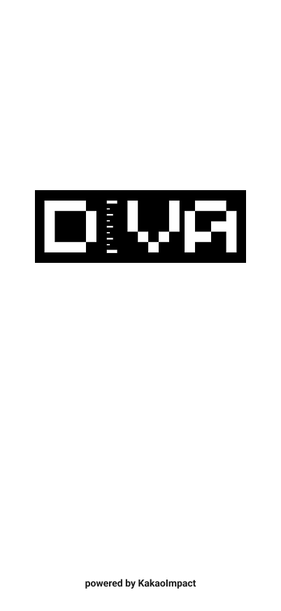

# Tech for Impact: Service Certification Guidelines

## 개요
테크포임팩트 보증은 해당 프로젝트가 카카오임팩트의 테크포임팩트 프로그램을 통해 개발되었음을 나타내는 공식적인 인증입니다. 이는 프로젝트의 기술적 신뢰성과 사회적 임팩트를 보증합니다.

### 보증의 의미
- 카카오임팩트의 기술 이니셔티브를 통한 개발
- 사회문제 해결을 위한 기술 프로젝트
- 지속가능한 임팩트 창출 지향

### 보증 사용 원칙
1. 일관성: 모든 프로젝트에서 동일한 디자인 가이드라인 준수
2. 가시성: 사용자가 쉽게 인지할 수 있는 위치에 배치
3. 정확성: 제공된 문구와 디자인 요소를 변형 없이 사용

## 1. 서비스 보증 (Service Certification)
실제 운영되는 웹사이트, 앱 등 서비스에 적용되는 보증 가이드라인입니다.

### 1.1 웹사이트 보증
다음 중 한 가지 방식을 선택하여 적용:

#### A. 하단 텍스트 방식
- 위치: 웹사이트 하단 푸터
- 구성요소:
  - 보증문구 : "본 서비스는 카카오임팩트의 기술 이니셔티브 테크포임팩트의 지원으로 개발되었습니다."
  - '테크포임팩트' 하이퍼 링크 : 테크포임팩트 홈페이지 링크 (https://techforimpact.io/)
- 스타일: 푸터의 전체 디자인과 조화되도록 구성

#### B. 하단 띠배너 (Footer Banner)
- 위치: 웹사이트 하단
- 구성요소:
  - 카카오임팩트 로고
  - 보증문구: "본 서비스는 카카오임팩트의 기술 이니셔티브 테크포임팩트의 지원으로 개발되었습니다."
  - 링크: 테크포임팩트 홈페이지 연결
- 디자인 스펙:
  - 배경색: #FAE100
  - 높이: 300px
  - 로고 크기: 높이 42px
  - 폰트: Pretendard
  - 폰트 색상: #202020
- 구현 예시


### 1.2 모바일 앱 보증
#### 스플래시 화면
- 위치: 앱 실행 시 최초 로딩 화면
- 구성요소:
  - 서비스 로고 (중앙)
  - "powered by KakaoImpact" 텍스트 (하단)
- 노출 시간: 2초
- 디자인 스펙:
  - 배경색: #FFFFFF
  - 서비스 로고: 화면 너비의 40% 이내
  - 텍스트 스타일:
    - 폰트: Systemfont
    - 크기: 14px
    - 색상: #1A1A1A
    - 위치: 하단에서 32px
- 구현 예시


#### 앱스토어/플레이스토어 설명
- 위치: 앱 설명 섹션 하단
- 필수 포함 문구: "본 앱은 카카오임팩트의 기술 이니셔티브 테크포임팩트의 지원으로 개발되었습니다."

#### 앱 About 페이지
- 위치: 앱 내 About 또는 설정 메뉴
- 구성:
  - 보증문구: "본 서비스는 카카오임팩트의 기술 이니셔티브 테크포임팩트의 지원으로 개발되었습니다."
  - 카카오임팩트 로고

### 1.3. 파트너십 표시
프로그램 파트너와 함께하는 프로젝트의 경우, 다음 가이드라인을 따릅니다:

#### 파트너 표시 영역
위치: 웹사이트 하단
- 구성요소:
  - 카카오임팩트 로고
  - 보증문구: "Our Partners / 함께하신분들"
- 디자인 스펙:
  - 배경색: #F5F3E6
  - 높이: 366px
  - 로고 크기: 높이 158px
  - 폰트: Pretendard
  - 크기: 26px
  - 폰트 색상: #1A1A1A
  
#### 로고 배치
- 기본 원칙: 카카오임팩트 로고가 주요 위치에 배치
- 파트너 로고: 
  - 프로그램 파트너 (예: 모두의연구소, KAIST 등)
  - 협력 기관 (예: 해양수산부, WHO 등)
- 배치 순서: 왼쪽에서 오른쪽으로, 또는 위에서 아래로 중요도 순
- 구현 예시


## 2. 오픈소스 보증 (Open Source Certification)
깃허브 등에 공개되는 오픈소스 프로젝트에 적용되는 보증 가이드라인입니다.

### 2.1 README.md 보증 섹션
```markdown
## Acknowledgement
본 프로젝트는 카카오임팩트 테크포임팩트 프로그램을 통해 개발되었습니다.

```

### 2.2 라이선스 문구
LICENSE 파일 상단에 추가:
```
Copyright (c) [연도] [프로젝트명]
Developed with support from Kakao Impact Tech for Impact Program.
```

## 3. 자산 및 리소스
- 로고 다운로드: [assets/kakao_impact_logo.png]
- 폰트 다운로드: [Pretendard](https://noonnu.cc/font_page/694#google_vignette)

## 4. 보증 적용 프로세스
1. 보증 요청
   - 프로젝트 담당자가 테크포임팩트 사무국에 보증 적용 요청
   - 필요한 자산 및 가이드라인 수령

2. 디자인 검수
   - 적용된 보증 디자인 검토
   - 필요시 수정 요청 및 피드백

3. 최종 승인
   - 테크포임팩트 사무국의 최종 확인
   - 보증 적용 완료 확인

## 5. 보증 사용 시 유의사항
- 보증은 프로젝트의 전체 기간 동안 유지되어야 합니다
- 로고나 문구의 변형은 허용되지 않습니다

## 6. 자주 묻는 질문
자주 묻는 질문 사항은 [서비스 보증 FAQ](./service-certification-FAQ.md)를 참고해 주세요. 웹사이트, 모바일 앱, 오픈소스 등 다양한 형태의 서비스에 대한 보증 적용 방법 등에 대한 상세한 답변을 확인하실 수 있습니다.

## 7. 문의
문의사항은 이메일로 연락 주세요 : <br>
- 랩 : 카카오임팩트 김민석 매니저(taylor.7@kakaoimpact.org)
- 캠퍼스 : 카카오임팩트 문숙희 매니저 (ki.ik@kakaoimpact.org) 